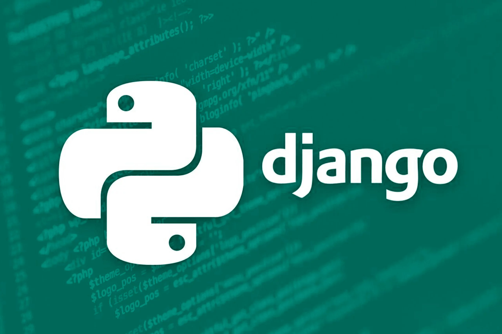

    
    <h1> Django Boilerplate App </h1>

This repository was created with the intention of providing developers with a
starter app to kick-off their Back-End Projects using Python with Django.

## Contributing

We welcome contributions from the developer community! Whether it's reporting
bugs, suggesting improvements, or submitting pull requests, your input is
invaluable to the success of this project. Please refer to the ⁠`CONTRIBUTING.md`
file for guidelines on how to contribute.
